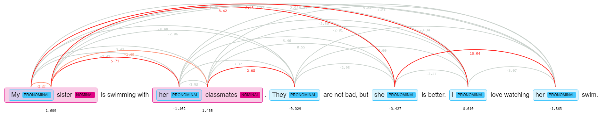

## Проектное задание по курсу “Автоматическая обработка естественного языка”

### [Rewiew (eng)](https://docs.google.com/document/d/1FYkekhNb7sOFXjIawUwOUmNSuf0j3NyQ8ddWlJeaA0k/edit?usp=sharing)

[Presentation (rus)](https://docs.google.com/presentation/d/1EhnfB3wuJFnXnpF3jcF5z0zpGHSagnKs5mm5RUwsXhQ/edit?usp=sharing)

[Model predictions](https://docs.google.com/spreadsheets/d/1An5a-AwULjZdOwNeOJpzQCXnwK169yWyskPuAGYe9_c/edit?usp=sharing)

Metrics on a GAP test set:
|model|recall|precision|f1|
|-----|------|---------|--|
|Bert|0,61|0,76|0,68|
|**SpanBert**|**0,63**|**0,84**|**0,72**|
|NeuralCoref|0,33|0,59|0,42|

Contributors:
- [Анна Кузнецова](https://github.com/kuzanna2016)
- [Георгий Лоншаков](https://github.com/miltend)
- [Анна Полянская](https://github.com/polyankaglade)
- [Егор Яцишин](https://github.com/toskn)

*NRU HSE, 2020*
